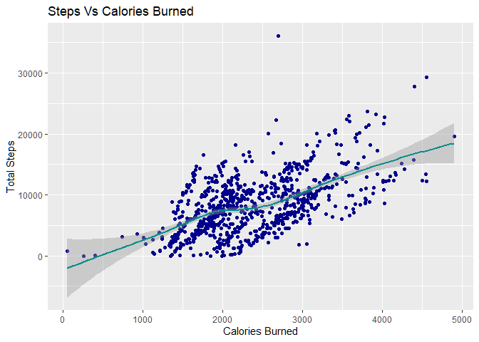

### About Bellabeat

Bellabeat, founded in 2013 by Urška Sršen and Sando Mur, is a wellness
tech company creating beautifully designed smart products for women.
Their devices track activity, sleep, stress, and reproductive health,
empowering women with health insights. Bellabeat markets extensively
online and via traditional media channels.

### Questions for Analysis

1.  What are some trends in smart device usage?
2.  How could these trends apply to Bellabeat customers?
3.  How could these trends help influence Bellabeat marketing strategy?

### Business task

Identify growth opportunities and provide recommendations to enhance
Bellabeat’s marketing strategy by analyzing trends in smart device
usage.

### Loading packages

``` r
library(tidyverse)
```

    ## ── Attaching core tidyverse packages ──────────────────────── tidyverse 2.0.0 ──
    ## ✔ dplyr     1.1.4     ✔ readr     2.1.5
    ## ✔ forcats   1.0.0     ✔ stringr   1.5.1
    ## ✔ ggplot2   3.5.1     ✔ tibble    3.2.1
    ## ✔ lubridate 1.9.3     ✔ tidyr     1.3.1
    ## ✔ purrr     1.0.2     
    ## ── Conflicts ────────────────────────────────────────── tidyverse_conflicts() ──
    ## ✖ dplyr::filter() masks stats::filter()
    ## ✖ dplyr::lag()    masks stats::lag()
    ## ℹ Use the conflicted package (<http://conflicted.r-lib.org/>) to force all conflicts to become errors

``` r
library(lubridate)
library(dplyr)
library(ggplot2)
library(tidyr)
```

### Importing datasets

``` r
activity <- read.csv("dailyActivity_merged.csv")
calories <- read.csv("hourlyCalories_merged.csv")
intensities <- read.csv("hourlyIntensities_merged.csv")
sleep <- read.csv("sleepDay_merged.csv")
weight <- read.csv("weightLogInfo_merged.csv")
```

### Understanding datesets and types

``` r
head(activity)
```

    ##           Id ActivityDate TotalSteps TotalDistance TrackerDistance
    ## 1 1503960366    4/12/2016      13162          8.50            8.50
    ## 2 1503960366    4/13/2016      10735          6.97            6.97
    ## 3 1503960366    4/14/2016      10460          6.74            6.74
    ## 4 1503960366    4/15/2016       9762          6.28            6.28
    ## 5 1503960366    4/16/2016      12669          8.16            8.16
    ## 6 1503960366    4/17/2016       9705          6.48            6.48
    ##   LoggedActivitiesDistance VeryActiveDistance ModeratelyActiveDistance
    ## 1                        0               1.88                     0.55
    ## 2                        0               1.57                     0.69
    ## 3                        0               2.44                     0.40
    ## 4                        0               2.14                     1.26
    ## 5                        0               2.71                     0.41
    ## 6                        0               3.19                     0.78
    ##   LightActiveDistance SedentaryActiveDistance VeryActiveMinutes
    ## 1                6.06                       0                25
    ## 2                4.71                       0                21
    ## 3                3.91                       0                30
    ## 4                2.83                       0                29
    ## 5                5.04                       0                36
    ## 6                2.51                       0                38
    ##   FairlyActiveMinutes LightlyActiveMinutes SedentaryMinutes Calories
    ## 1                  13                  328              728     1985
    ## 2                  19                  217              776     1797
    ## 3                  11                  181             1218     1776
    ## 4                  34                  209              726     1745
    ## 5                  10                  221              773     1863
    ## 6                  20                  164              539     1728

``` r
head(calories)
```

    ##           Id          ActivityHour Calories
    ## 1 1503960366 4/12/2016 12:00:00 AM       81
    ## 2 1503960366  4/12/2016 1:00:00 AM       61
    ## 3 1503960366  4/12/2016 2:00:00 AM       59
    ## 4 1503960366  4/12/2016 3:00:00 AM       47
    ## 5 1503960366  4/12/2016 4:00:00 AM       48
    ## 6 1503960366  4/12/2016 5:00:00 AM       48

``` r
head(activity)
```

    ##           Id ActivityDate TotalSteps TotalDistance TrackerDistance
    ## 1 1503960366    4/12/2016      13162          8.50            8.50
    ## 2 1503960366    4/13/2016      10735          6.97            6.97
    ## 3 1503960366    4/14/2016      10460          6.74            6.74
    ## 4 1503960366    4/15/2016       9762          6.28            6.28
    ## 5 1503960366    4/16/2016      12669          8.16            8.16
    ## 6 1503960366    4/17/2016       9705          6.48            6.48
    ##   LoggedActivitiesDistance VeryActiveDistance ModeratelyActiveDistance
    ## 1                        0               1.88                     0.55
    ## 2                        0               1.57                     0.69
    ## 3                        0               2.44                     0.40
    ## 4                        0               2.14                     1.26
    ## 5                        0               2.71                     0.41
    ## 6                        0               3.19                     0.78
    ##   LightActiveDistance SedentaryActiveDistance VeryActiveMinutes
    ## 1                6.06                       0                25
    ## 2                4.71                       0                21
    ## 3                3.91                       0                30
    ## 4                2.83                       0                29
    ## 5                5.04                       0                36
    ## 6                2.51                       0                38
    ##   FairlyActiveMinutes LightlyActiveMinutes SedentaryMinutes Calories
    ## 1                  13                  328              728     1985
    ## 2                  19                  217              776     1797
    ## 3                  11                  181             1218     1776
    ## 4                  34                  209              726     1745
    ## 5                  10                  221              773     1863
    ## 6                  20                  164              539     1728

``` r
head(sleep)
```

    ##           Id              SleepDay TotalSleepRecords TotalMinutesAsleep
    ## 1 1503960366 4/12/2016 12:00:00 AM                 1                327
    ## 2 1503960366 4/13/2016 12:00:00 AM                 2                384
    ## 3 1503960366 4/15/2016 12:00:00 AM                 1                412
    ## 4 1503960366 4/16/2016 12:00:00 AM                 2                340
    ## 5 1503960366 4/17/2016 12:00:00 AM                 1                700
    ## 6 1503960366 4/19/2016 12:00:00 AM                 1                304
    ##   TotalTimeInBed
    ## 1            346
    ## 2            407
    ## 3            442
    ## 4            367
    ## 5            712
    ## 6            320

I spotted some problems with the time stamp data. So before analysis, I
need to convert it to date time format and split to date and time.

Intensities

``` r
intensities$ActivityHour=as.POSIXct(intensities$ActivityHour, format="%m/%d/%Y %I:%M:%S %p", tz=Sys.timezone())
intensities$time <- format(intensities$ActivityHour, format = "%H:%M:%S")
intensities$date <- format(intensities$ActivityHour, format = "%m/%d/%y")
head(intensities)
```

    ##           Id        ActivityHour TotalIntensity AverageIntensity     time
    ## 1 1503960366 2016-04-12 00:00:00             20         0.333333 00:00:00
    ## 2 1503960366 2016-04-12 01:00:00              8         0.133333 01:00:00
    ## 3 1503960366 2016-04-12 02:00:00              7         0.116667 02:00:00
    ## 4 1503960366 2016-04-12 03:00:00              0         0.000000 03:00:00
    ## 5 1503960366 2016-04-12 04:00:00              0         0.000000 04:00:00
    ## 6 1503960366 2016-04-12 05:00:00              0         0.000000 05:00:00
    ##       date
    ## 1 04/12/16
    ## 2 04/12/16
    ## 3 04/12/16
    ## 4 04/12/16
    ## 5 04/12/16
    ## 6 04/12/16

Calories

``` r
calories$ActivityHour=as.POSIXct(calories$ActivityHour, format="%m/%d/%Y %I:%M:%S %p", tz=Sys.timezone())
calories$time <- format(calories$ActivityHour, format = "%H:%M:%S")
calories$date <- format(calories$ActivityHour, format = "%m/%d/%y")
head(calories)
```

    ##           Id        ActivityHour Calories     time     date
    ## 1 1503960366 2016-04-12 00:00:00       81 00:00:00 04/12/16
    ## 2 1503960366 2016-04-12 01:00:00       61 01:00:00 04/12/16
    ## 3 1503960366 2016-04-12 02:00:00       59 02:00:00 04/12/16
    ## 4 1503960366 2016-04-12 03:00:00       47 03:00:00 04/12/16
    ## 5 1503960366 2016-04-12 04:00:00       48 04:00:00 04/12/16
    ## 6 1503960366 2016-04-12 05:00:00       48 05:00:00 04/12/16

Activity

``` r
activity$ActivityDate=as.POSIXct(activity$ActivityDate, format="%m/%d/%Y", tz=Sys.timezone())
activity$date <- format(activity$ActivityDate, format = "%m/%d/%y")
head(activity)
```

    ##           Id ActivityDate TotalSteps TotalDistance TrackerDistance
    ## 1 1503960366   2016-04-12      13162          8.50            8.50
    ## 2 1503960366   2016-04-13      10735          6.97            6.97
    ## 3 1503960366   2016-04-14      10460          6.74            6.74
    ## 4 1503960366   2016-04-15       9762          6.28            6.28
    ## 5 1503960366   2016-04-16      12669          8.16            8.16
    ## 6 1503960366   2016-04-17       9705          6.48            6.48
    ##   LoggedActivitiesDistance VeryActiveDistance ModeratelyActiveDistance
    ## 1                        0               1.88                     0.55
    ## 2                        0               1.57                     0.69
    ## 3                        0               2.44                     0.40
    ## 4                        0               2.14                     1.26
    ## 5                        0               2.71                     0.41
    ## 6                        0               3.19                     0.78
    ##   LightActiveDistance SedentaryActiveDistance VeryActiveMinutes
    ## 1                6.06                       0                25
    ## 2                4.71                       0                21
    ## 3                3.91                       0                30
    ## 4                2.83                       0                29
    ## 5                5.04                       0                36
    ## 6                2.51                       0                38
    ##   FairlyActiveMinutes LightlyActiveMinutes SedentaryMinutes Calories     date
    ## 1                  13                  328              728     1985 04/12/16
    ## 2                  19                  217              776     1797 04/13/16
    ## 3                  11                  181             1218     1776 04/14/16
    ## 4                  34                  209              726     1745 04/15/16
    ## 5                  10                  221              773     1863 04/16/16
    ## 6                  20                  164              539     1728 04/17/16

Sleep

``` r
sleep$SleepDay=as.POSIXct(sleep$SleepDay, format="%m/%d/%Y %I:%M:%S %p", tz=Sys.timezone())
sleep$date <- format(sleep$SleepDay, format = "%m/%d/%y")
head(sleep)
```

    ##           Id   SleepDay TotalSleepRecords TotalMinutesAsleep TotalTimeInBed
    ## 1 1503960366 2016-04-12                 1                327            346
    ## 2 1503960366 2016-04-13                 2                384            407
    ## 3 1503960366 2016-04-15                 1                412            442
    ## 4 1503960366 2016-04-16                 2                340            367
    ## 5 1503960366 2016-04-17                 1                700            712
    ## 6 1503960366 2016-04-19                 1                304            320
    ##       date
    ## 1 04/12/16
    ## 2 04/13/16
    ## 3 04/15/16
    ## 4 04/16/16
    ## 5 04/17/16
    ## 6 04/19/16

### Exploring and summarizing data

``` r
n_distinct(activity$Id)
```

    ## [1] 33

``` r
n_distinct(calories$Id)
```

    ## [1] 33

``` r
n_distinct(intensities$Id)
```

    ## [1] 33

``` r
n_distinct(sleep$Id)
```

    ## [1] 24

``` r
n_distinct(weight$Id)
```

    ## [1] 8

The activity, calories, and intensities data sets include 33
participants, while the sleep data set has 24 participants. However, the
weight data set consists of only 8 participants, which is insufficient
to draw any reliable conclusions or make informed recommendations based
on this data.

### Summary statistics

Activity

``` r
activity %>%  
  select(TotalSteps,
         TotalDistance,
         SedentaryMinutes, Calories) %>%
  summary()
```

    ##    TotalSteps    TotalDistance    SedentaryMinutes    Calories   
    ##  Min.   :    0   Min.   : 0.000   Min.   :   0.0   Min.   :   0  
    ##  1st Qu.: 3790   1st Qu.: 2.620   1st Qu.: 729.8   1st Qu.:1828  
    ##  Median : 7406   Median : 5.245   Median :1057.5   Median :2134  
    ##  Mean   : 7638   Mean   : 5.490   Mean   : 991.2   Mean   :2304  
    ##  3rd Qu.:10727   3rd Qu.: 7.713   3rd Qu.:1229.5   3rd Qu.:2793  
    ##  Max.   :36019   Max.   :28.030   Max.   :1440.0   Max.   :4900

Number of active minutes per category

``` r
activity %>%
  select(VeryActiveMinutes, FairlyActiveMinutes, LightlyActiveMinutes) %>%
  summary()
```

    ##  VeryActiveMinutes FairlyActiveMinutes LightlyActiveMinutes
    ##  Min.   :  0.00    Min.   :  0.00      Min.   :  0.0       
    ##  1st Qu.:  0.00    1st Qu.:  0.00      1st Qu.:127.0       
    ##  Median :  4.00    Median :  6.00      Median :199.0       
    ##  Mean   : 21.16    Mean   : 13.56      Mean   :192.8       
    ##  3rd Qu.: 32.00    3rd Qu.: 19.00      3rd Qu.:264.0       
    ##  Max.   :210.00    Max.   :143.00      Max.   :518.0

Calories

``` r
calories %>%
  select(Calories) %>%
  summary()
```

    ##     Calories     
    ##  Min.   : 42.00  
    ##  1st Qu.: 63.00  
    ##  Median : 83.00  
    ##  Mean   : 97.39  
    ##  3rd Qu.:108.00  
    ##  Max.   :948.00

Sleep

``` r
sleep %>%
  select(TotalSleepRecords, TotalMinutesAsleep, TotalTimeInBed) %>%
  summary()
```

    ##  TotalSleepRecords TotalMinutesAsleep TotalTimeInBed 
    ##  Min.   :1.000     Min.   : 58.0      Min.   : 61.0  
    ##  1st Qu.:1.000     1st Qu.:361.0      1st Qu.:403.0  
    ##  Median :1.000     Median :433.0      Median :463.0  
    ##  Mean   :1.119     Mean   :419.5      Mean   :458.6  
    ##  3rd Qu.:1.000     3rd Qu.:490.0      3rd Qu.:526.0  
    ##  Max.   :3.000     Max.   :796.0      Max.   :961.0

Weight

``` r
weight %>%
  select(WeightKg, BMI) %>%
  summary()
```

    ##     WeightKg           BMI       
    ##  Min.   : 52.60   Min.   :21.45  
    ##  1st Qu.: 61.40   1st Qu.:23.96  
    ##  Median : 62.50   Median :24.39  
    ##  Mean   : 72.04   Mean   :25.19  
    ##  3rd Qu.: 85.05   3rd Qu.:25.56  
    ##  Max.   :133.50   Max.   :47.54

Key findings from the summary include:

-   The average sedentary time is 991 minutes (16 hours), which needs to
    be reduced.
-   Most participants are lightly active.
-   On average, participants sleep once for 7 hours.
-   The average daily step count is 7,638, which is slightly below the
    threshold for health benefits. According to CDC research, taking
    8,000 steps daily is linked to a 51% lower risk of all-cause
    mortality, while 12,000 steps daily reduces the risk by 65% compared
    to 4,000 steps.

### Merging Data

``` r
merged_data <- merge(sleep, activity, by=c('Id', 'date'))
head(merged_data)
```

    ##           Id     date   SleepDay TotalSleepRecords TotalMinutesAsleep
    ## 1 1503960366 04/12/16 2016-04-12                 1                327
    ## 2 1503960366 04/13/16 2016-04-13                 2                384
    ## 3 1503960366 04/15/16 2016-04-15                 1                412
    ## 4 1503960366 04/16/16 2016-04-16                 2                340
    ## 5 1503960366 04/17/16 2016-04-17                 1                700
    ## 6 1503960366 04/19/16 2016-04-19                 1                304
    ##   TotalTimeInBed ActivityDate TotalSteps TotalDistance TrackerDistance
    ## 1            346   2016-04-12      13162          8.50            8.50
    ## 2            407   2016-04-13      10735          6.97            6.97
    ## 3            442   2016-04-15       9762          6.28            6.28
    ## 4            367   2016-04-16      12669          8.16            8.16
    ## 5            712   2016-04-17       9705          6.48            6.48
    ## 6            320   2016-04-19      15506          9.88            9.88
    ##   LoggedActivitiesDistance VeryActiveDistance ModeratelyActiveDistance
    ## 1                        0               1.88                     0.55
    ## 2                        0               1.57                     0.69
    ## 3                        0               2.14                     1.26
    ## 4                        0               2.71                     0.41
    ## 5                        0               3.19                     0.78
    ## 6                        0               3.53                     1.32
    ##   LightActiveDistance SedentaryActiveDistance VeryActiveMinutes
    ## 1                6.06                       0                25
    ## 2                4.71                       0                21
    ## 3                2.83                       0                29
    ## 4                5.04                       0                36
    ## 5                2.51                       0                38
    ## 6                5.03                       0                50
    ##   FairlyActiveMinutes LightlyActiveMinutes SedentaryMinutes Calories
    ## 1                  13                  328              728     1985
    ## 2                  19                  217              776     1797
    ## 3                  34                  209              726     1745
    ## 4                  10                  221              773     1863
    ## 5                  20                  164              539     1728
    ## 6                  31                  264              775     2035

### Visualization

``` r
ggplot(data=activity, aes(x=TotalSteps, y=Calories)) + 
  geom_point(color='darkblue') + geom_smooth(color='darkcyan') + labs(title="Total Steps vs. Calories")
```

    ## `geom_smooth()` using method = 'loess' and formula = 'y ~ x'


I observe a positive correlation between total steps and calories, which
is expected – increased activity leads to higher calorie expenditure.

``` r
ggplot(data=sleep, aes(x=TotalMinutesAsleep, y=TotalTimeInBed)) + 
  geom_point(color='darkblue')+ geom_smooth(color='darkcyan') + 
  labs(title="Total Minutes Asleep vs. Total Time in Bed")
```

    ## `geom_smooth()` using method = 'loess' and formula = 'y ~ x'


The relationship between total minutes asleep and total time in bed
appears linear. To help Bellabeat users improve their sleep, we should
consider sending notifications to remind them to go to bed.

``` r
int_new <- intensities %>%
  group_by(time) %>%
  drop_na() %>%
  summarise(mean_total_int = mean(TotalIntensity))

ggplot(data=int_new, aes(x=time, y=mean_total_int)) + geom_histogram(stat = "identity", fill='darkcyan') +
  theme(axis.text.x = element_text(angle = 90)) +
  labs(title="Average Total Intensity vs. Time")
```

    ## Warning in geom_histogram(stat = "identity", fill = "darkcyan"): Ignoring
    ## unknown parameters: `binwidth`, `bins`, and `pad`


After visualizing total intensity hourly, I discovered that people are
more active between 5 AM and 10 PM. The peak activity period is between
5 PM and 7 PM, likely due to people going to the gym or for a walk after
work. We can use this time in the Bellabeat app to send reminders and
motivate users to go for a run or walk.

``` r
ggplot(data=merged_data, aes(x=TotalMinutesAsleep, y=SedentaryMinutes)) + 
  geom_point(color='darkblue') + geom_smooth(color='darkcyan') +
  labs(title="Minutes Asleep vs. Sedentary Minutes")
```

    ## `geom_smooth()` using method = 'loess' and formula = 'y ~ x'



We can observe a clear inverse correlation between Sedentary Minutes and
Sleep Time. To enhance sleep quality, the Bellabeat app could suggest
reducing sedentary behavior.

### Recommendations for the business

Based on our data collection on activity, sleep, stress, and
reproductive health, Bellabeat has successfully empowered women by
providing valuable insights into their health and habits. Since its
establishment in 2013, Bellabeat has rapidly grown and established
itself as a leading tech-driven wellness company focused on women’s
health.

Following an analysis of FitBit Fitness Tracker Data, I’ve identified
key insights that can significantly impact Bellabeat’s marketing
strategy.

### Target audience

Our target audience includes individuals, particularly those working
full-time jobs and spending extended periods at computers or in
meetings, as indicated by our data on hourly intensity and sedentary
time. These individuals engage in light activities for health
maintenance, but they may benefit from guidance on enhancing their daily
physical activity for greater health benefits. We aim our campaign
towards all genders, assuming equal representation in our dataset.

### Key message for the Bellabeat online campaign

The core message of Bellabeat’s online campaign is that our app goes
beyond typical fitness applications. It serves as a supportive guide,
empowering individuals—especially women—to achieve a balanced lifestyle
by providing education and motivation through personalized daily
recommendations.

### Ideas for the Bellabeat app

The average daily step count of 7,638 falls short of the CDC’s
recommended 10,000 steps for significant health benefits. Research shows
that achieving 10,000 steps per day correlates with a 51% lower risk of
all-cause mortality, with even greater benefits at 12,000 steps per day,
associated with a 65% lower risk compared to 4,000 steps. Bellabeat can
encourage users to reach at least 8,000 steps daily by highlighting
these health advantages.

For weight loss goals, monitoring daily calorie intake is essential.
Bellabeat can suggest low-calorie lunch and dinner options to assist
users in managing their caloric consumption effectively.

To enhance sleep quality, Bellabeat could utilize app notifications to
remind users of optimal bedtime routines.

The peak activity period between 5 pm and 7 pm suggests that users may
engage in exercise after work. Bellabeat can capitalize on this window
to motivate and remind users to engage in physical activities like
running or walking.

As part of improving sleep, Bellabeat could recommend reducing sedentary
time through its app.
